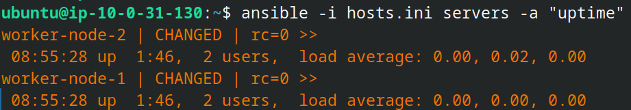
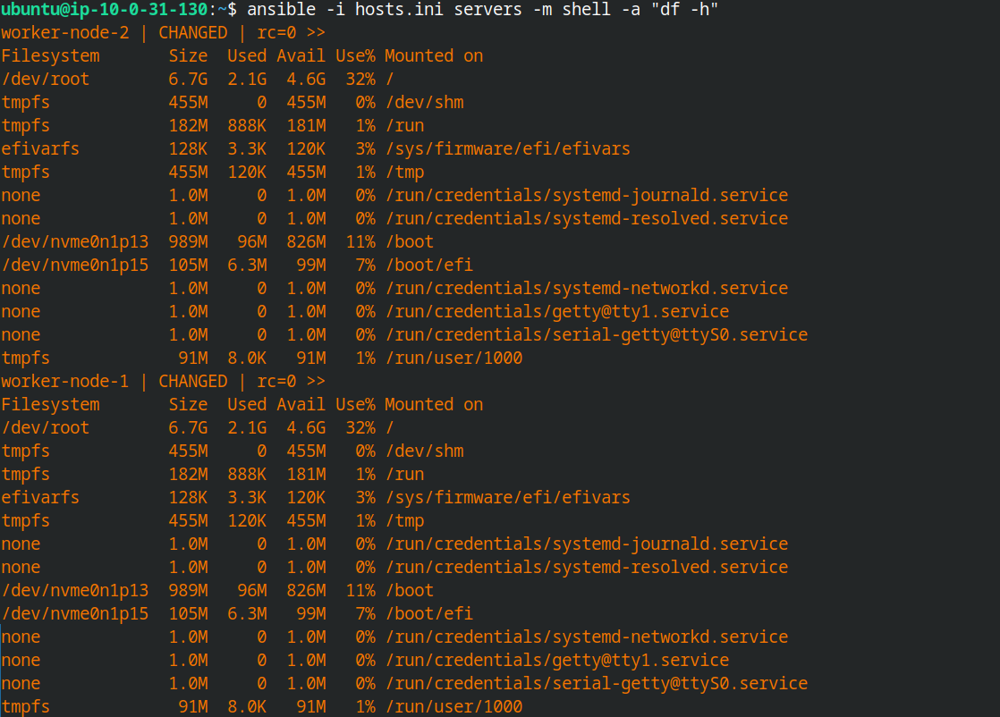
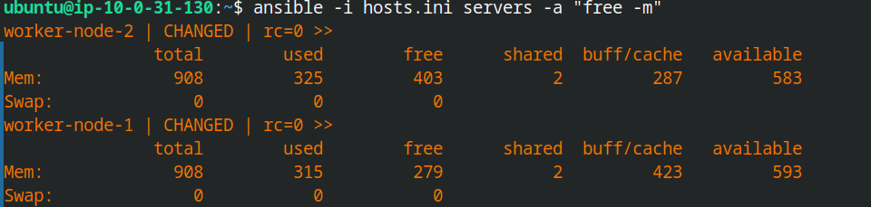

# Ansible Commands Reference

This file explains the most important Ansible CLI commands and when to use them.

Ansible has many plugins and options, so this guide focuses on the commands you will use most often while learning and working with Ansible.

## 1. `ansible`

Use this command for ad-hoc tasks on managed nodes.

Examples:

```
ansible -i hosts.ini servers -m ping #pinging to check if the devices are reachable
ansible -i hosts.ini servers -m command -a "uptime" #uptime
ansible -i hosts.ini servers -m shell -a "df -h" #disk space
ansible -i hosts.ini servers -a "free -m" #free memory
ansible -i hosts.i servers -a "sudo apt update"
ansible -i hosts.ini servers -a "apt-get install -y nginx" --become #install nginx with privilege escalation
```








What it does:

- Runs a module on one or more hosts.
- Good for quick checks and one-off tasks.
- Uses inventory groups such as `servers` or `workers`.

Useful options:

- `-i hosts.ini`: use a specific inventory file.
- `-m ping`: run the `ping` module.
- `-a "..."`: pass arguments to the module.
- `-u ubuntu`: override the SSH user.
- `-b` / `--become`: run commands with privilege escalation (sudo). Use when installing packages or performing root-only actions.
- `--ask-become-pass`: prompt for sudo password if needed.

## 2. `ansible-playbook`

Use this command to run YAML playbooks.

Examples:

```
ansible-playbook -i hosts.ini playbook.yml
ansible-playbook -i hosts.ini playbook.yml --syntax-check
ansible-playbook -i hosts.ini playbook.yml --check
```

What it does:

- Executes a playbook against the inventory.
- Best for repeatable automation.
- Supports roles, tasks, handlers, and variables.

Useful options:

- `--syntax-check`: validates YAML and playbook structure.
- `--check`: dry run mode.
- `--diff`: shows file/content changes where supported.
- `--limit servers`: run only on a subset of hosts.

## 3. `ansible-inventory`

Use this command to inspect inventory data.

Examples:

```
ansible-inventory -i hosts.ini --list
ansible-inventory -i hosts.ini --graph
```

What it does:

- Shows the parsed inventory structure.
- Helps confirm groups, host aliases, and variables.
- Useful when debugging inventory problems.

## 4. `ansible-config`

Use this command to inspect Ansible configuration settings.

Examples:

```
ansible-config view
ansible-config dump --only-changed
```

What it does:

- Displays active Ansible settings.
- Helps confirm that `ansible.cfg` is being used.
- Shows defaults and overridden values.

## 5. `ansible-doc`

Use this command to read documentation for modules, plugins, and collections.

Examples:

```
ansible-doc ping
ansible-doc copy
ansible-doc -l
```

What it does:

- Shows module parameters, examples, and notes.
- Helps you learn which module to use.

## 6. `ansible-galaxy`

Use this command to manage roles and collections.

Examples:

```
ansible-galaxy collection install community.general
ansible-galaxy role init webserver
```

What it does:

- Installs reusable content from Ansible Galaxy.
- Creates a role skeleton.
- Manages dependencies for roles and collections.

## 7. `ansible-vault`

Use this command to encrypt and manage secrets.

Examples:

```
ansible-vault create secrets.yml
ansible-vault edit secrets.yml
ansible-vault view secrets.yml
ansible-vault encrypt_string 'mypassword' --name 'db_password'
```

What it does:

- Protects sensitive data such as passwords and API keys.
- Keeps secrets out of plain text files in git.

## 8. `ansible-pull`

Use this command when managed nodes pull a playbook from a repository instead of the control node pushing it.

Example:

```
ansible-pull -U https://github.com/example/repo.git site.yml
```

What it does:

- Pulls playbooks from git and runs them locally on the target host.
- Useful for self-updating systems or scheduled automation.

## 9. `ansible-test`

Use this command when developing Ansible content such as modules, plugins, or collections.

Example:

```
ansible-test sanity
```

What it does:

- Runs sanity and integration tests for Ansible content.
- Mostly used by contributors and advanced users.

## 10. Common command workflow

For a new lab or project, this order is usually helpful:

1. Check inventory with `ansible-inventory`.
2. Check settings with `ansible-config`.
3. Read module docs with `ansible-doc`.
4. Test connectivity with `ansible -m ping`.
5. Run your playbook with `ansible-playbook`.
6. Protect secrets with `ansible-vault`.

## 11. Quick examples for your AWS lab

```
ansible -i hosts.ini servers -m ping
ansible-playbook -i hosts.ini playbook.yml
ansible-inventory -i hosts.ini --graph
ansible-config dump --only-changed
```

## 12. Important note

Ansible has many subcommands and plugin-specific options, so this guide covers the core commands you will use most often. If you want, this file can be expanded with a module-by-module reference later.

## 13. Common flags and short options

This short reference explains common single-letter and long-form flags you will see with `ansible` and `ansible-playbook`.

```
-m                Module name (ad-hoc). Example: ansible -i hosts.ini web -m ping
-a                Module arguments (ad-hoc). Example: ansible -i hosts.ini web -m command -a "uptime"
-i                Inventory file or comma-separated hosts. Example: ansible-playbook -i hosts.ini site.yml
-e / --extra-vars Pass extra variables. Example: ansible-playbook -i hosts.ini site.yml -e "env=prod version=1.2"
-u                Remote SSH user. Example: ansible -i hosts.ini all -m ping -u ubuntu
-b / --become     Run tasks with privilege escalation (sudo). Example: ansible-playbook -i hosts.ini site.yml -b
-k / --ask-pass   Prompt for SSH password. Example: ansible -i hosts.ini all -m ping -k
-K / --ask-become-pass Prompt for privilege escalation password. Example: ansible-playbook -i hosts.ini site.yml -b -K
-f                Forks (parallelism). Example: ansible -i hosts.ini all -m ping -f 20
-c                Connection type (ssh, local, paramiko). Example: ansible -i hosts.ini localhost -c local -m command -a "whoami"
-t / --tags       Run only tasks with specified tags (playbook). Example: ansible-playbook -i hosts.ini site.yml -t install
--limit / -l      Limit hosts or groups to run on. Example: ansible-playbook -i hosts.ini site.yml --limit webservers
--check           Dry run (do not make changes). Example: ansible-playbook -i hosts.ini site.yml --check
--diff            Show file differences for changed files. Example: ansible-playbook -i hosts.ini site.yml --diff
--start-at-task   Start playbook run at a given task name. Example: ansible-playbook -i hosts.ini site.yml --start-at-task "Configure app"
```

Notes:
- Many short flags have equivalent long forms (`-e` ⇄ `--extra-vars`, `-b` ⇄ `--become`).
- Flags may differ slightly between `ansible` (ad-hoc) and `ansible-playbook` — check `ansible --help` or `ansible-playbook --help` for command-specific options.
- For complex `-e` values use JSON or a file: `-e '{"var": "value"}'` or `-e @vars.yml`.

If you'd like, I can move this section earlier in the file or expand entries with more examples.

## 14. Playbooks

Playbooks are YAML files that define one or more "plays" — a play maps a group of hosts to roles or tasks. Playbooks are the primary method for orchestrating complex, repeatable automation in Ansible.

Key concepts:

- **Play**: A mapping between hosts and the tasks to run on them (starts with `- hosts:`).
- **Task**: An individual action that calls a module (e.g., `apt`, `service`, `template`).
- **Handler**: A special task triggered by `notify:`; typically used for service restarts.
- **Role**: A reusable collection of tasks, handlers, files, templates, and defaults.
- **Variables**: Used to parametrize playbooks (`vars`, `vars_files`, `--extra-vars`).
- **Become**: Privilege escalation (sudo) to run tasks that require root.
- **Tags**: Mark tasks to run a subset with `--tags`.

Basic run command:

```
ansible-playbook -i hosts.ini playbooks/install_nginx.yml
```

Playbook tips:

- Use `--check` for dry runs and `--diff` to view file changes.
- Prefer modules (`apt`, `service`, `copy`, `template`) over shell commands for idempotence.
- Organize complex automation into roles for reuse and clarity.

Inventory selection note:

- Example: `ansible-playbook -i ../hosts.ini hello.yml` explicitly uses the inventory file at `../hosts.ini`.
- Running `ansible-playbook hello.yml` without `-i` uses the inventory defined in `ansible.cfg`, the `ANSIBLE_INVENTORY`/`ANSIBLE_HOSTS` environment variable, or `/etc/ansible/hosts` (in that order of precedence).
- The CLI `-i` option overrides any configuration or environment settings — use it for predictable runs.
- Preview which hosts will be targeted with `--list-hosts`, e.g.: `ansible-playbook -i ../hosts.ini hello.yml --list-hosts`.

Example playbook file: [playbooks/install_nginx.yml](playbooks/install_nginx.yml)

Would you like additional example playbooks (users/roles, deploying an app, templates)?